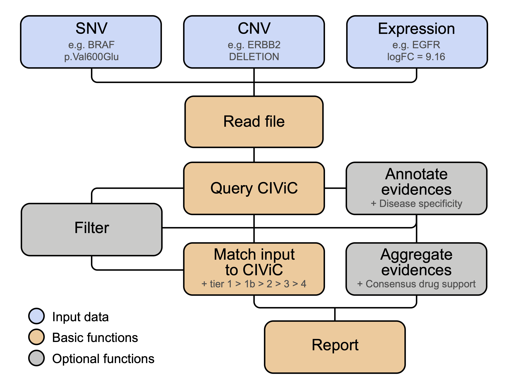

# CIViCutils

## General overview

[CIViCutils](https://github.com/ETH-NEXUS/civicutils) is a Python package for rapid retrieval, annotation, prioritization and downstream processing of information from the expert-curated [CIViC knowledgebase](https://civicdb.org/home) (Clinical Interpretations of Variants in Cancer). CIViCutils can be integrated into novel and existing clinical workflows to provide variant-level disease-specific information about treatment response, pathogenesis, diagnosis, and prognosis of genomic aberrations (SNVs, InDels and CNVs), as well as differentially expressed genes. It streamlines interpreting large numbers of input alterations with querying and analyzing CIViC information, and enables the harmonization of input across different nomenclatures. Key features of CIViCutils include an automated matching framework for linking clinical evidence to input variants, as well as evaluating the accuracy of the resulting hits, and in-silico prediction of drug-target interactions tailored to individual patients and cancer subtypes of interest.




## Installation instructions

TODO


### Dependencies
- [CIViCpy](https://github.com/griffithlab/civicpy):
To install, first activate the conda environment and then use pip install:

```
>> pip install civicpy
```

The CIViC query implemented in CIViCutils makes use of an offline cache file of the CIViC database. The cache is provided by CIViCpy and retrieved with the initial installation of the CIViCutils package. Afterwards, users have to manually update the cache file if they want to leverage a new release version.
To update the cache file, open a Python session and load package `civicpy`.
Then type:
```
>> civic.update_cache()
```


## Documentation

### Required input format

Three different data types can be handled by the package: `SNV` (genomic single-nucleotide and insertion-deletion variants), `CNV` (genomic copy number alterations), and `EXPR` data (differentially expressed genes).

#### SNVs (`SNV`)

An input file of SNV data can be processed using CIViCutils function `readInSnvs()`.
Assumes header and the following columns:
* `Gene`: required. One gene symbol per row allowed. Cannot be empty.
* `Variant_dna`: required. HGVS c. annotation for the variant (can be several possible annotations referring to the same variant, listed in a comma-separated list with no spaces). Can be empty, but at least one non-empty variant annotation must be provided across `Variant_dna` and `Variant_prot` per row.
* `Variant_prot`: required. HGVS p. annotation for the variant, if available (can can be several possible annotations referring to the same variant, listed in a comma-separated list with no spaces). Can be empty, but at least one non-empty variant annotation must be provided across `Variant_dna` and `Variant_prot` per row.
* `Variant_impact`: optional. Single or comma-separated list of variant impact annotations with no spaces. Such annotations (e.g. `intron_variant` or `frameshift_variant`) can be retrieved using tools like e.g. VEP or snpEff. Can be empty.
* `Variant_exon`: optional. Single or comma-separated list of variant exon annotations with no spaces. Such annotations (format: `EXON/N_EXONS` or `INTRON/N_INTRONS`, e.g. `1/11`) can be retrieved using tools like e.g. VEP or snpEff. If provided, then `Variant_impact` must exist and elements in both list must have a 1-1 correspondance. The reason is that the variant impact tag will be used to determine if the exon annotation is intronic or exonic. Can be empty.

#### CNVs (`CNV`)

An input file of CNV data can be processed using CIViCutils function `readInCnvs()`.
Assumes header and the following columns:
* `Gene`: required. One gene symbol per row allowed. Cannot be empty.
* `Variant_cnv`: required. The following types of copy number variation annotations are allowed as input: `AMPLIFICATION`, `AMP`, `GAIN`, `DUPLICATION`, `DUP`, `DELETION`, `DEL`, `LOSS`. Several possible annotations referring to the same copy variant can be provided in a comma-separated list with no spaces. Cannot be empty.

#### Expression (`EXPR`)

An input file of differential gene expression data can be processed using CIViCutils function `readInExpr()`.
Assumes header and the following columns:
* `Gene`: required. One gene symbol per row allowed. Cannot be empty.
* `logFC`: required. Log fold-change value for the given gene. The sign of the fold-change will be used to match variants in CIViC (either `OVEREXPRESSION` if logFC>0 or `OVEREXPRESSION` if logFC<0). Cannot be empty and only one value allowed per row.


### Querying CIViC

CIViCutils leverages the offline cache file of the CIViC database provided by [CIViCpy](https://docs.civicpy.org/en/latest/), which allows performing high-throughput queries to the database. Queries can only be gene-based and will return all variants which are annotated in CIViC for each queried gene (only if any exist). Three types of identifiers can be handled: `entrez_symbol`, `entrez_id` and `civic_id`.
```
from query import query_civic

# Query list of input genes in CIViC
varMap = query_civic(genes, identifier_type="entrez_symbol")
```

Structure of the variant map (i.e. dictionary `varMap`):
```
<varMap>
└── <gene_id>
    └── <var_id>
        ├── 'name'
        ├── 'civic_score'
        ├── 'hgvs'
        ├── 'types'
        ├── 'n_evidence_items'
        └── 'evidence_items'
            └── <evidence_type>
                └── <disease>
                    └── <drug>
                        └── <evidence>
                            └── <level>
                                └── <evidence_item>
```

Structure of `varMap` after being annotated for disease specificity (i.e. `ct`):
```
<varMap>
└── <gene_id>
    └── <var_id>
        ├── 'name'
        ├── 'civic_score'
        ├── 'hgvs'
        ├── 'types'
        ├── 'n_evidence_items'
        └── 'evidence_items'
            └── <evidence_type>
                └── <ct>
                    └── <disease>
                        └── <drug>
                            └── <evidence>
                                └── <level>
                                    └── <evidence_item>
```


### Matching to CIViC

Three different types of input data can be provided to function `match_in_civic()`: `SNV`, `CNV` and `EXPR` (see above for more information). `SNV` (genomic single-nucleotide and insertion-deletion variants), `CNV` (genomic copy number alterations), and `EXPR` (differentially expressed genes).

In order to match variants, the package attempts to infer the names of the corresponding CIViC variant records by using: the provided input HGVS strings (only possible for SNV), HGVS expressions available in CIViC (if any exist, and only available for SNV) and most importantly, using a set of rules to translate how variants are normally named when introduced into the database (e.g. for variant `p.Val600Glu`, the corresponding record name would be `V600E`). For matching input data of types `CNV` and `EXPR`, the most common variant record names that exist for these in CIViCdb are considered.

The user can choose to provide a custom `varMap` to perform the match, e.g. if further filtering of the retrieved CIViC evidences needs to be applied. We highly recommend this, specially to select only evidences tagged as `ACCEPTED` and avoid matching of submitted evidence that has not yet been expert-reviewed. In the case of genomic variants, it is also recommended to filter for the desired variant type (e.g. `SOMATIC`, `GERMLINE`, etc.).
If `varMap` is not provided in the arguments of `match_in_civic()`, then per default the function will retrieve the information for the input genes from the cache file, without applying any filtering.
```
from match import match_in_civic

# Function will automatically query the db for the available genes
(matchMap,matchedIds,varMap) = match_in_civic(inData, dataType="SNV", identifier_type="entrez_symbol", select_tier="highest", varMap=None)

# Provide a custom set of CIViC evidences to match against
(matchMap,matchedIds,varMap) = match_in_civic(inData, dataType="SNV", identifier_type="entrez_symbol", select_tier="highest", varMap=varMap)
```

Structure of the match map (i.e. dictionary `matchMap`):

```
<matchMap>
└── <gene_id>
    └── <input_variant>
        └── <tier>
            └── <var_id>
```

The returned `matchMap` will contain the same genes and variants from `inData`, with additional entries per gene+variant combination for all the available tier categories listing the matches found (if any). The possible tiers are:
* `tier_1`: perfect match of the variant in CIViCdb, e.g. `p.Val600Glu` matched to `V600E`.
* `tier_1b`: a synonym (more general) match of the variant in CIViCdb, e.g. records like `MUTATION`, `FRAMESHIFT VARIANT` or `EXON 1 VARIANT`.
* `tier_2`: positional matches of the variant in CIViCdb, e.g. `V600M` and `V600K` returned when `V600E` was provided. Note there is a special case of so-called "general" variants, e.g. `V600`, which are prioritized over any other positional hits which may have also been found by CIViCutils.
* `tier_3`: gene was found in CIViCdb but no variant could be matched. All CIViC variant records available for the gene that are found to match the given data type will be returned (if any). If a `tier_3` was indicated but no matched variants appear listed, then that means that there were no records found to match the provided data type for the given gene (but that there are records available in CIViCdb for other data types).
* `tier_4`: gene was not found in CIViCdb. No hits were returned by the query.


Structure of the returned `matchMap` after being annotated for consensus drug support:
```
└── <matchMap>
    └── <gene_id>
        └── <input_variant>
            └── <tier>
                ├── 'matched'
                │   └── <var_id>
                └── 'drug_support'
                    └── <support>
```


### Filtering

#### Filtering CIViC information

CIViCutils enables filtering of CIViC data based on several features. A comprehensive overview of features is provided below. Note supplied filtering parameters are evaluated in the order in which they are listed in the function definition, and not in the order specified during the function call. The logic for combining multiple filters is always 'AND'; when the desired filtering logic in not possible in one single call, then the function needs to be applied to the data subsequently several times.

Complete list of filters available:
* Select or exclude specific gene identifiers (Entrez symbols, Entrez IDs or CIViC IDs).
* Select or exclude genes based on their number of associated CIViC variant records.
* Select or exclude specific CIViC variant identifiers.
* Select or exclude specific CIViC variant names.
* Select or exclude CIViC variants based on their associated CIViC score.
* Select or exclude CIViC variants based on their associated variant types.
* Select or exclude CIViC variants based on their number of associated evidence records.
* Select or exclude CIViC clinical records based on their associated evidence type.
* Select or exclude evidence records based on their associated cancer type.
* Select or exclude predictive records based on their associated drug name.
* Select or exclude records based on their associated evidence direction.
* Select or exclude evidence records based on their associated clinical significance.
* Select or exclude records based on their associated evidence level.
* Select or exclude records based on their associated evidence status.
* Select or exclude records based on the status of their supporting publication/source.
* Select or exclude CIViC records based on the presumed origin of the variant.
* Select or exclude records based on the types of supporting sources available.
* Select or exclude evidence records based on their associated rating.

```
from filtering import filter_civic
filteredMap = filter_civic(varMap, evidence_status_in = ['ACCEPTED'], var_origin_in = ['SOMATIC'], output_empty=False)
```
NOTE: use of argument `output_empty=True` is not recommended, as other functions may behave unexpectedly or not work entirely when `varMap` containes empty entries.


#### Filtering matched variants

Filtering or prioritizing matched variants by tier is also possible after matching to the CIViC has already been performed, e.g. if function `match_in_civic()` was initially run with argument `select_tier=all` and now further filtering by tier is desired.

This function cannot be applied if the provided `matchMap` was already processed and annotated for drug support information.


### Annotation of CIViC evidence with disease specificity

Variant-specific evidence data retrieved from CIViC can be further annotated for cancer specificity of the disease using function `annotate_ct()`. This is only possible if the provided `varMap` is not already annotated with disease specificity.

Afterwards, it is possible to filter or prioritize the annotated CIViC evidences by cancer specificity using `filter_ct()`: argument `select_ct` can be either a string (only "highest" makes sense, as "all" would not perform any filtering) or a list of categories to select for e.g. ['ct','gt'] to remove any evidences classified as non cancer specific. Option "highest" would select only the evidences from the highest available category per evidence type. Filtering is only possible if the provided `varMap` has been previously annotated with this information via `annotate_ct()`.
```
from match import annotate_ct,filter_ct

annotMap = annotate_ct(varMap, disease_name_not_in, disease_name_in, alt_disease_names)

# Filter based on cancer specificity
# Argument select_ct can be either "highest" or a list of allowed ct categories
filteredMap = filter_ct(annotMap, select_ct)
```

#### Parameters for annotating disease specificity

In order to classify each disease and its associated evidences as cancer specific, general or not specific, lists of terms can be provided. Excluding evidences from undesired diseases can also be done at this step.

Relevant and non-allowed disease names or terms can be provided as lists in `disease_name_in` and `disease_name_not_in`, respectively. In both cases, partial matches are sought, e.g. `small` will match `non-small cell lung cancer` and `lung small cell carcinoma`, while `non-small` will only match `non-small cell lung cancer`. In the same manner, be aware that `uveal melanoma` will only match `uveal melanoma` and not `melanoma`. As CIViC contains some higher-level disease names which are database specific, e.g. `cancer` or `solid tumor`, terms provided in the `alt_disease_names` list only allow exact matches, e.g. `cancer` will only match `cancer` and not `lung cancer`. Search terms should always be provided as a list, even if only one single term, and multiple words per term are allowed, e.g. [`ovarian`,`solid tumor`,`sex cord-stromal`] and [`solid tumor`] are both valid parameter inputs.

To select the evidences that will be reported, the following logic is applied based on their associated disease name:
* If any non-allowed terms are provided in `disease_name_not_in`, partial matches to the available disease names will be sought and any matched evidences will be entirely excluded from the query.
* From the remaining set, partial matches to the relevant terms in `disease_name_in` will be sought, and if any diseases are matched, then their associated evidences will be tagged as cancer specific with `ct`.
* From the remaining set, exact matches to the high-level terms in `alt_disease_names` will be considered as a fall-back case. Evidences associated to the matched diseases will be tagged with general specificity `gt`.
* All remaining evidences available will be tagged as non specific with `nct`, regardless of the associated disease.

The above logic is applied separately for each evidence type (one of `Predictive`, `Diagnostic`, `Prognostic` or `Predisposing`). This means that evidences classified as e.g. `Predictive` might be associated to a different set of disease names compared to those classified as e.g. `Diagnostic`.

To ease the selection of the appropriate parameter terms for a particular disease, we provide a helper file `civic_available_diseases_[DATE].txt` listing all disease names available in CIViC as of `[DATE]`. To update this file, run the following script as follows, replacing `[DATE]` withe new date:

TODO
    > python /path_to_civicutils/scripts/get_available_diseases_in_civic.py --outFile /path_to_civicutils/civic_available_diseases_[DATE].txt


### Annotation of consensus drug response predictions

Function `process_drug_support()` will decide on a consensus drug support for each available tier match and every associated disease specificity category. Note this function can only be applied if the provided `varMap` has been previously annotated with cancer type specificity information. After the annotation of consensus predictions, the returned `matchMap` will contain additional entries per tier: 'matches', containing the variant hits found in CIViC (if any), and 'drug_support', listing one string for each consensus drug response annotated using format `DISEASE:CT:SUPPORT`.

Conversion of CIViC evidences (terms used for evidence direction and clinical significance) into a specific drug support string can be done through a custom dictionary `drug_support` within the config file `data.yml`.

TODO


### Output

Matched CIViC variants can be written to output using function `write_match()`.
Additional columns that were present in the original input table can be provided in a list with argument `header` (list is always retuned upon reading of the input data file).
* When input `varMap` is annotated for disease specificity, then `hasCt=True` must be selected (and viceversa). Use argument `writeCt` to append the cancer specificity tag to each reported disease.
* When input `matchMap` was processed for drug support, then `hasSupport=True` must be selected (and viceversa). Use argument `writeSupport` to include one additional column listing the consensus drug supports of each tier (one support for each available drug and disease specificity).
* Use argument `writeComplete=False` to only list the ids of the publications supporting each reported evidence item. When `writeComplete=True`, additional information will be reported as `ID:EVIDENCE_STATUS:SOURCE_STATUS:VARIANT_ORIGIN:RATING`.
```
from read_and_write import write_match

write_match(matchMap, varMap, rawData, header, dataType="SNV", outfile, hasSupport=True, hasCt=True, writeCt=False, writeSupport=True, writeComplete=False)
```

Format of the reported evidences
TODO


#### Other output functions
* `write_to_json()`: reports CIViC data into an output file using JSON format.
* `write_to_yaml()`: reports CIViC data into an output file using YAML format.


## Demo

```
# Import relevant functions
from read_and_write import readInSnvs,get_dict_support,write_match
from query import query_civic
from filtering import filter_civic
from match import match_in_civic,annotate_ct,filter_ct,process_drug_support

# Read in file of input SNV variants
(rawData,snvData,extraHeader) = readInSnvs("civicutils/data/example_snv.txt")

# Query input genes in CIViC
varMap = query_civic(list(snvData.keys()), identifier_type="entrez_symbol")
# Filter undesired evidences to avoid matching later on
varMap = filter_civic(varMap, evidence_status_in = ['ACCEPTED'], var_origin_not_in = ['GERMLINE'], output_empty=False)

# Match input SNV variants in CIViC, pick highest tier available per input gene+variant
# Tier hierarchy: 1 > 1b > 2 > 3 > 4
(matchMap,matchedIds,varMap) = match_in_civic(snvData, dataType="SNV", identifier_type="entrez_symbol", select_tier="highest", varMap=varMap)

# Annotate matched CIViC evidences with cancer specificity of the associated diseases
disease_name_not_in = []
disease_name_in = ['bladder']
alt_disease_names = ['solid tumor']
annotMap = annotate_ct(varMap, disease_name_not_in, disease_name_in, alt_disease_names)

# Filter CIViC evidences to pick only those for the highest cancer specificity available
# ct hierarchy: ct > gt > nct
annotMap = filter_ct(annotMap,select_ct="highest")

# Get custom dictionary of support from data.yml (provided within the package)
# This defines how each combination of evidence direction + clinical significance in CIViC is classified in terms of drug support (e.g. sensitivity, resistance, unknown, etc.)
supportDict = get_dict_support()

# Process drug support of the matched variants using the annotated CIViC evidences
annotMatch = process_drug_support(matchMap,annotMap,supportDict)

# Write to output
# Do not report the CT classification of each disease, and write column with the overall drug support of the match for each available CT class
write_match(annotMatch, annotMap, rawData, extraHeader, dataType="SNV", outfile, hasSupport=True, hasCt=True, writeCt=False, writeSupport=True, writeComplete=False)
```


